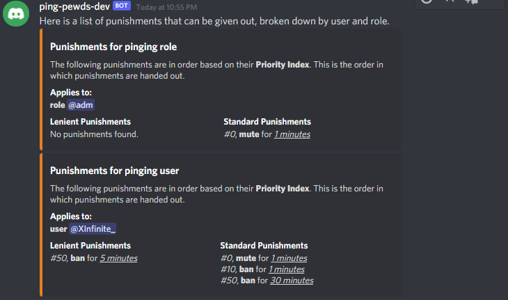
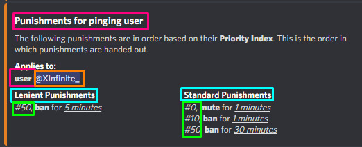
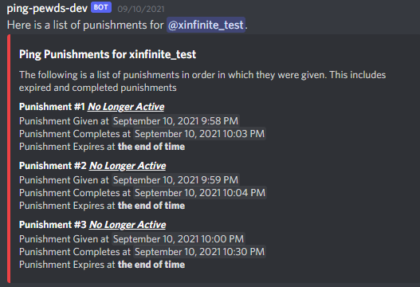

# Commands provided by this bot

This guide assumes that the command prefix is `!`. Wherever you see the `!` symbol, you should assume
that this is whatever the prefix is set to by the administrators.

## Monitored User Commands
##### These are commands that are only available to users who should have ping protection.
____

### Extend Ping Window
```
!extend <TIME>
```
* `<TIME>` - The number of minutes that you will be allowed to be pinged

This is primarily meant to act as an AFK button. If you plan to leave for longer than
the standard ping window and you want to still be pinged, you can *extend* the time you'll be
allowed to be pinged. **If you speak after running this command in a monitored channel**,
your ping window will be reset back to the standard ping window.

<div style="margin-bottom:50px"></div>

### Clear Ping Window
```
!clear
```
Immediately stops you from being pinged. Anyone who pings you after you enter this command
will be punished.


____

## Moderation Commands
##### These commands are used to maintain punishment options
___

### Punishments Help
```
!punishments [help]
```
* `help` - is optional

Will give you an inline guide on what each sub command should do.

<div style="margin-bottom:50px"></div>

### Punishments List
```
!punishments list
```

Returns several embeds depending on how many users and roles are monitored.
Below is an example output



<div style="margin-bottom:50px"></div>

### Punishment Create
```
!punishments create <INDEX> <TYPE> <TARGET> <KEY> <LIENIENT> <LENGTH>
```
* `<INDEX>` - The priority in which the punishment is given out. Lower priority is given first
* `<TYPE>` - `ban`, `mute`, or `kick`
* `<TARGET>` - `user` or `role`
* `<KEY>` - Either a user ID or role ID depending on what `<TARGET>` you provide
* `<LENIENT>` - yes/no/true/false (booleanish)
* `<LENGTH>` - The amount of time in minutes the punishment should be

This function is used to create punishment options for roles and users.
You have the ability to define multiple punishments for virtually any person or role
within the guild.

<div style="margin-bottom:50px"></div>

### Punishment Remove
```
!punishments remove <INDEX> <TARGET> <KEY> <LENIENT>
```
* `<INDEX>` - The priority in which the punishment is given out. Lower priority is given first
* `<TARGET>` - `user` or `role`
* `<KEY>` - Either a user ID or role ID depending on what `<TARGET>` you provide
* `<LENIENT>` - yes/no/true/false (booleanish)

This function is used to remove a punishment option for roles or roles. You will
need to know all the information above, **but** you can get this information
by running `!punishments list`.



* **Green** - this is your index
* **Pink** - this is your target
* **orange** - this is your key
* **Blue** - this is lenient or not

<div style="margin-bottom:50px"></div>

### Punishments For User
```
!punishments for <USER>
```
* `<USER>` - the user to look up punishments

This returns an embed containing the punishments that
the user has received in the past.


